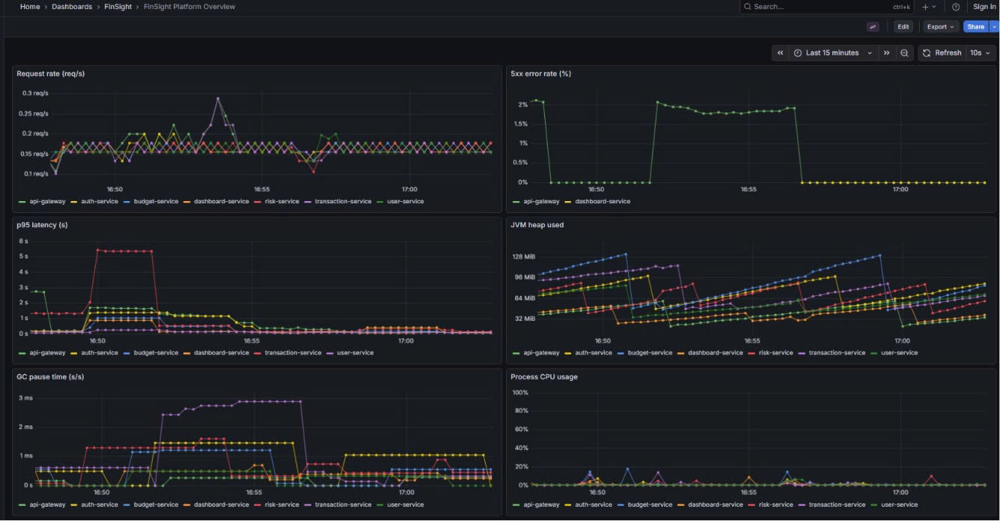
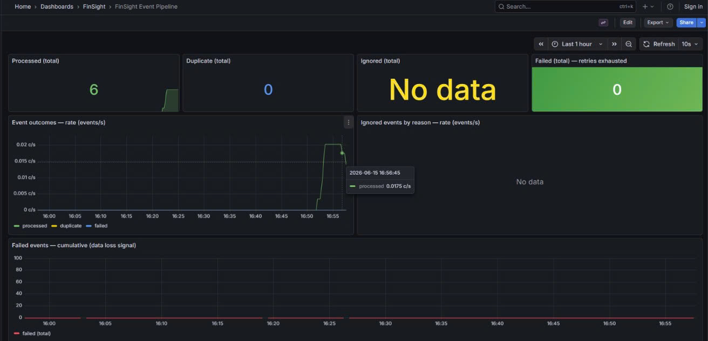
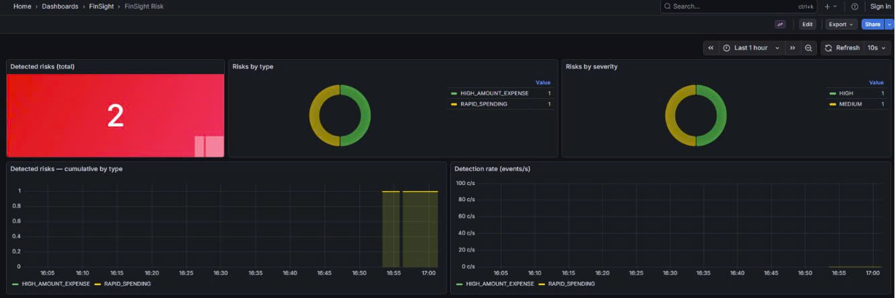
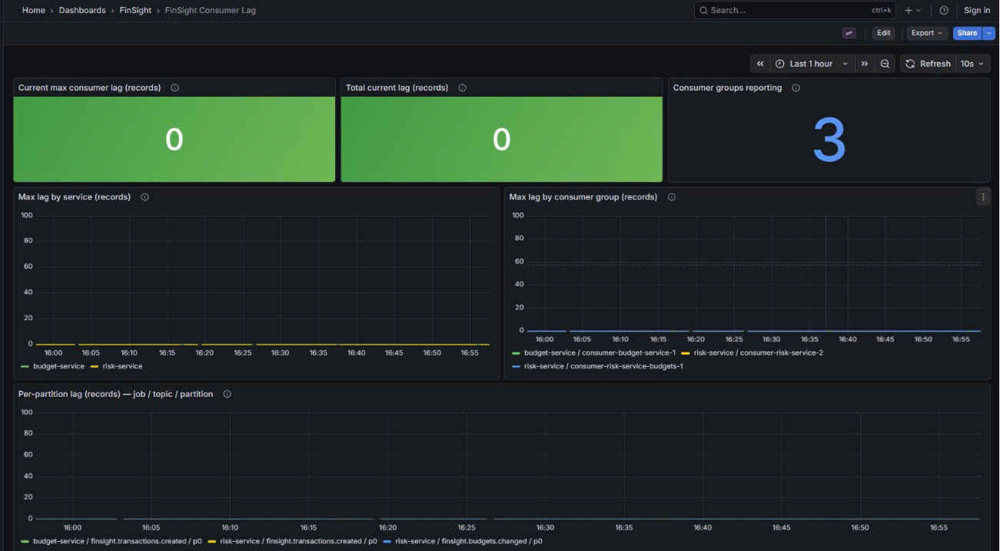

# FinSight

[](https://github.com/Trieu-hub/finsight-platform/actions/workflows/ci.yml)

**Financial Intelligence & Risk Monitoring Platform** — a Spring Boot 4 / Java 21
microservice monorepo.

FinSight is an event-driven finance platform: users record transactions and budgets over a
REST API, and an asynchronous Kafka backbone feeds a **risk-intelligence** service that
derives risk alerts, behavioral insights, and anomalies from the activity. Each service owns
its own database and the only synchronous fan-out is a read-only BFF; all other cross-service
coupling is asynchronous over Kafka.

> **Status:** working MVP with a rule-based intelligence layer. The intelligence is
> **rule-based, not ML**. See [Roadmap / not yet built](#roadmap--not-yet-built) for what is
> intentionally absent, and [`project-status.md`](project-status.md) for a detailed breakdown.

## Documentation

| Doc | Contents |
|---|---|
| [`docs/architecture.md`](docs/architecture.md) | Service boundaries, request/event flow, diagrams |
| [`docs/event-catalog.md`](docs/event-catalog.md) | Every Kafka event: producer, consumers, payloads |
| [`docs/intelligence.md`](docs/intelligence.md) | Risk rules, insights, anomalies — triggers & metrics |
| [`docs/runbook.md`](docs/runbook.md) | Startup, compose workflow, Kafka/Prometheus/Grafana verification, troubleshooting |
| [`project-status.md`](project-status.md) | Phase-by-phase completion and roadmap |
| [`docs/ADR-0004-budget-utilization-via-events.md`](docs/ADR-0004-budget-utilization-via-events.md) | Why budget utilization is event-driven (and its accepted drift) |

## Tech stack

- **Java 21**, **Spring Boot 4.0.6**, Spring Security, Spring Data JPA
- **MySQL 8** — one shared instance, one logical database per service
- **Redis** — used by auth-service (refresh tokens + brute-force lockout)
- **Kafka** (single-node KRaft broker) — asynchronous event backbone
- **Flyway** — schema ownership (`ddl-auto: validate`)
- **JWT** (HS512, shared HMAC secret) — issued by auth-service, validated by every service
- **springdoc / OpenAPI** — API docs on the user-facing REST services
- **Micrometer + Prometheus + Grafana** — metrics and dashboards
- **Docker / Docker Compose**, **GitHub Actions** (CI), **Testcontainers** (integration tests)
- **React 19 + TypeScript + Vite + TailwindCSS** — single-page web client (see [Web frontend](#web-frontend))

## Architecture summary

```
                 ┌──────────────┐
   Client ─────▶ │ api-gateway  │  edge JWT validation + routing
                 │   :8080      │
                 └──────┬───────┘
        ┌───────────┬───┴────┬────────────┬─────────────┐
        ▼           ▼        ▼            ▼             ▼
   auth :8081  user :8082  tx :8083   budget :8084  dashboard :8085
   auth_db     user_db     transaction_db budget_db   (no DB, BFF)
        │                     │            │   ▲          │ calls user/tx/budget
        │                     │            │   │          ▼ (REST, relays JWT)
     (Redis)                  │            │   │
                              ▼            ▼   │
                       ┌───────────── Kafka ───────────────┐
                       │ finsight.transactions.created      │
                       │ finsight.budgets.changed           │
                       │ finsight.risk.detected             │
                       └───────────────┬───────────────────┘
                                       ▼
                                 risk-service :8086  ──▶ risk_db
                                 (risk rules · insights · anomalies)
```

- **Synchronous** (HTTP/REST): client → gateway → owning service; the dashboard BFF fans out
  to user/transaction/budget, relaying the caller's JWT (fail-fast). No other business service
  calls another at runtime.
- **Asynchronous** (Kafka): transaction-service produces `TransactionCreated`; budget-service
  and risk-service consume it; budget-service produces `BudgetChanged` (consumed by
  risk-service); risk-service produces `RiskDetected` (best-effort, no consumer yet).

Full diagrams (Mermaid) are in [`docs/architecture.md`](docs/architecture.md).

**Design rules** (enforced in code): no runtime cross-service calls except the dashboard BFF;
`userId` is read only from the JWT; Flyway owns every schema; every service validates the JWT
locally (the gateway stays removable); `risk-service` is internal (no JWT stack, not behind the
gateway).

## Service inventory

| Service | Port | Database | Inbound | Responsibility |
|---|---|---|---|---|
| `api-gateway` | 8080 | – | HTTP | Edge routing + JWT validation (HS512/issuer/audience) |
| `auth-service` | 8081 | `auth_db` | HTTP | Register, login, refresh, account lockout; Redis-backed tokens |
| `user-service` | 8082 | `user_db` | HTTP | User profile data |
| `transaction-service` | 8083 | `transaction_db` | HTTP | Transactions (INCOME/EXPENSE), categories, summaries; **produces** `TransactionCreated` |
| `budget-service` | 8084 | `budget_db` | HTTP, Kafka | Budget definitions + utilization; **consumes** `TransactionCreated`, **produces** `BudgetChanged` |
| `dashboard-service` | 8085 | _(none, BFF)_ | HTTP | Read-only aggregation over user/transaction/budget; relays JWT; fail-fast |
| `risk-service` | 8086 (internal) | `risk_db` | Kafka | Risk rules, behavioral insights, anomaly detection; **consumes** `TransactionCreated` + `BudgetChanged`, **produces** `RiskDetected`; read APIs. Port not host-published (SE-2) |

## Databases

One **MySQL 8** instance hosts five logical databases (DB-per-service isolation):

| Database | Owner | Notable tables |
|---|---|---|
| `auth_db` | auth-service | users, roles, refresh-token records |
| `user_db` | user-service | user_profiles |
| `transaction_db` | transaction-service | transactions, categories |
| `budget_db` | budget-service | budgets (incl. `spent_amount`), `processed_events` (idempotency inbox) |
| `risk_db` | risk-service | `risk_alerts`, `observed_expenses`, `insights`, `budget_snapshots`, `anomalies` |

`dashboard-service` owns no database. **Redis** backs only auth-service.

## Kafka topics

Single-node KRaft broker; JSON without type headers; keyed by `userId`; at-least-once delivery
with idempotent consumers. Full payloads in [`docs/event-catalog.md`](docs/event-catalog.md).

| Topic | Producer | Consumer(s) |
|---|---|---|
| `finsight.transactions.created` | transaction-service | budget-service, risk-service |
| `finsight.budgets.changed` | budget-service | risk-service |
| `finsight.risk.detected` | risk-service | _(none yet — best-effort notification)_ |

## Implemented intelligence

All in **risk-service**, derived from the `observed_expenses` read-model fed by the
`TransactionCreated` consumer — **no ML, no prediction**, simple counts/sums/averages only.
Triggers, severities, persistence, and metrics are detailed in
[`docs/intelligence.md`](docs/intelligence.md).

**Risk Monitoring** → persisted to `risk_alerts`, published as `RiskDetected`, exposed at
`GET /api/v1/risks`; metric `finsight.risk.events.detected{type,severity}`:

| Rule | Trigger | Severity |
|---|---|---|
| `HIGH_AMOUNT_EXPENSE` | A single EXPENSE ≥ 10,000,000 | HIGH |
| `RAPID_SPENDING` | 5th EXPENSE for a user within a 10-minute window | MEDIUM |
| `LARGE_DAILY_SPEND` | Daily EXPENSE total crosses above 20,000,000 | HIGH |

**Behavioral Insights** → persisted to `insights` (one per scope per month), exposed at
`GET /api/v1/insights`; metric `finsight.insights.generated{type}`:

| Insight | Trigger |
|---|---|
| `SPENDING_INCREASE` | Current-month expenses ≥ +30% vs previous month |
| `CATEGORY_SURGE` | Current-month category expenses ≥ +50% vs previous month |
| `BUDGET_RISK` | A matching budget's utilization exceeds 80% while its period is open |
| `LOW_SAVINGS_RATE` | Month with positive income where expenses reach ≥ 80% of income |

**Anomaly Detection** → persisted to `anomalies`, exposed at `GET /api/v1/anomalies`; metric
`finsight.anomalies.detected{type}`:

| Anomaly | Trigger |
|---|---|
| `UNUSUAL_TRANSACTION_AMOUNT` | An EXPENSE ≥ 3× the user's average historical expense, with ≥ 10 prior EXPENSE transactions |

> The risk-service read APIs (`/api/v1/risks`, `/api/v1/insights`, `/api/v1/anomalies`) are an
> internal/admin surface — unauthenticated by design, not behind the gateway, and **not published
> to the host** (reachable only on the compose network at `risk-service:8086`, SE-2).

## Observability stack

Every service exposes Micrometer metrics at `/actuator/prometheus` and liveness/readiness
probes at `/actuator/health/{liveness,readiness}`.

- **Prometheus** — <http://localhost:9090> — scrapes all seven services every 15s
  (`docker/prometheus/prometheus.yml`); check *Status → Targets*.
- **Grafana** — <http://localhost:3000> — auto-provisions the Prometheus datasource and four
  dashboards (folder **FinSight**, from `docker/grafana/provisioning/`):
  - **FinSight Platform Overview** — request rate, 5xx rate, p95 latency, JVM heap, GC, CPU.
  - **FinSight Event Pipeline** — budget consumer `processed` / `duplicate` / `ignored` / `failed`.
  - **FinSight Risk** — detected risks by type and severity.
  - **FinSight Consumer Lag** — Kafka consumer lag per service / group / partition.

> Dev-stack posture, on purpose: Grafana allows anonymous admin and the scrape endpoint is
> unauthenticated — acceptable on a local compose network, not a production posture.

### Dashboard screenshots

Live dashboards from the running stack (under [`docs/images/`](docs/images/)):






## Web frontend

A single-page React client (in [`web/`](web/)) consumes the platform's REST API through the
api-gateway. It is a thin presentation layer — all business logic, validation, and authorization
stay in the backend.

- **Vite + React 19 + TypeScript**, **React Router**, **Axios**, **TailwindCSS**.
- **JWT auth**: the token from `POST /api/v1/auth/login` is stored client-side and attached to
  every request by an Axios interceptor; a `401` clears it and redirects to `/login`. Protected
  routes are gated client-side for UX only — the backend remains the security boundary.
- **Pages**: Login / Register, Dashboard (income / expense / balance + recent activity + budget
  progress), Transactions (list + create), Budgets (list + utilization bars).
- **Dev proxy**: Vite forwards `/api` → `http://localhost:8080`, so the browser stays
  same-origin and no backend CORS configuration is needed (a reverse proxy plays this role in
  production).

```bash
npm install --prefix web
npm run dev --prefix web        # http://localhost:5173 (needs the stack running on :8080)
npm run build --prefix web      # type-check + production build to web/dist
```

## Local startup (Docker Compose)

The root `docker-compose.yml` builds all seven services and starts MySQL, Redis, Kafka,
Prometheus, and Grafana. All services share one `JWT_SECRET`.

**1. Secrets (`.env`) — required first.** No secrets live in compose; they are interpolated
from a gitignored `.env`. Compose refuses to start (clear `set X in .env` message) if any are
missing.

```bash
cp .env.example .env
# Fill in: JWT_SECRET (>= 64 bytes for HS512), MYSQL_ROOT_PASSWORD, and the five
# *_DB_PASSWORD values (AUTH/USER/TRANSACTION/BUDGET/RISK). Generation commands are in the file.
```

**2. Start the stack:**

```bash
docker compose up --build -d     # build images + start everything
docker compose ps                # watch readiness-gated startup
docker compose logs -f risk-service
docker compose down              # stop  (add -v to also drop MySQL/Prometheus/Grafana volumes)
```

**3. Verify health** (services are readiness-gated via healthchecks + `depends_on`):

```bash
# risk-service (8086) is not host-published (internal-only); check it via `docker compose ps`.
for p in 8080 8081 8082 8083 8084 8085; do
  curl -fsS http://localhost:$p/actuator/health/readiness && echo " <- $p OK"
done
```

On the **first** MySQL start, init scripts create the five databases and one least-privilege
user per service (`auth_user`, `user_user`, `transaction_user`, `budget_user`, `risk_user`) —
each service connects as its own user, never `root`. Kafka/MySQL/Redis ports are not published
to the host; see [`docs/runbook.md`](docs/runbook.md) for Kafka/Prometheus/Grafana verification
and troubleshooting.

> Init scripts run only against an empty data dir. If you have an existing `mysql_data` volume
> from before the risk-service database was added, recreate it with `docker compose down -v`.

### Run / test a single service

```bash
cd services/<service>
./mvnw spring-boot:run     # mvnw.cmd on Windows; needs a DB and (for JWT services) JWT_SECRET
./mvnw verify              # unit + Testcontainers integration tests (Docker required)
```

## Continuous Integration

GitHub Actions (`.github/workflows/ci.yml`) builds and tests every service on each
`pull_request` and on pushes to `main`. A single matrix job fans out across all **seven**
modules (`api-gateway`, `auth-service`, `user-service`, `transaction-service`, `budget-service`,
`dashboard-service`, `risk-service`):

- **JDK 21** (Temurin) with the Maven (`~/.m2`) cache enabled.
- Each module runs `mvn -B -ntp verify` — unit **and** Testcontainers integration tests in one
  pass (MySQL/Kafka containers via Testcontainers; the runner ships with Docker).
- `fail-fast` is off, so one run reports every failing service; failing modules upload their
  Surefire reports as artifacts.

> There is no aggregator pom; the matrix is what builds "all services" in CI.

## End-to-end validation

The full event-driven path is implemented and traceable in the repo (code + config), and the
runtime is captured by the committed Grafana dashboard screenshots above.

| Stage | Status | Evidence in repo |
|---|---|---|
| Expense creation (REST) | ✅ implemented | `transaction-service` |
| Kafka event published (`TransactionCreated`) | ✅ implemented | `transaction-service` producer → `finsight.transactions.created` |
| Risk detection executed | ✅ implemented | `risk-service` rules ([`docs/intelligence.md`](docs/intelligence.md)) |
| Database updated | ✅ implemented | `risk_db.risk_alerts` (Flyway-owned) |
| Prometheus metrics updated | ✅ implemented | `/actuator/prometheus` · `finsight.risk.events.detected{type,severity}` |
| Grafana dashboard updated | ✅ provisioned | `docker/grafana/provisioning/` (4 dashboards) |
| CI pipeline passing | ✅ workflow + badge | [`.github/workflows/ci.yml`](.github/workflows/ci.yml) |
| Runtime screenshots committed | ✅ committed | `docs/images/` (4 Grafana dashboards, embedded above) |

## Roadmap / not yet built

These are **absent from the codebase** — do not assume they exist:

- **gRPC** — no proto, no dependencies; all synchronous calls are REST.
- **Notification Service** — `RiskDetected` is produced but has no consumer / delivery yet.
- **Analytics engine** — distinct from the dashboard BFF (presentation only).
- **Transaction `TRANSFER`** — only INCOME/EXPENSE exist (`walletId` is scaffolded, unused).
- **ML-based intelligence** — current rules are deterministic and threshold-based.
- **Asymmetric JWT signing** (RS256/JWKS), **edge rate limiting**, **transactional outbox**,
  **distributed tracing**, **Prometheus alerting**, and a **production deployment target**
  (Kubernetes/TLS/managed secrets).

See [`project-status.md`](project-status.md) §5 for the prioritized roadmap.
