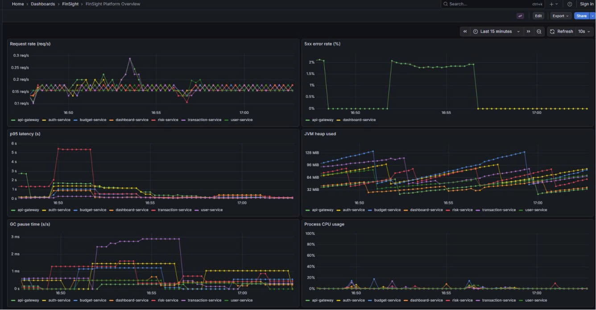
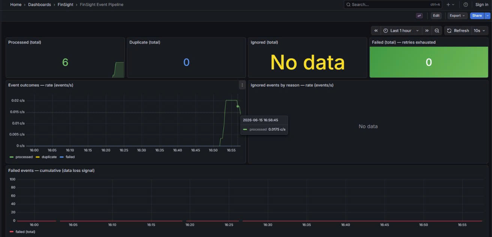
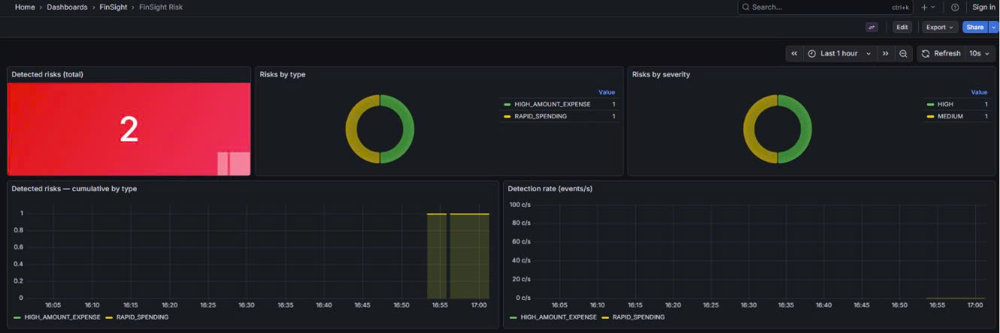
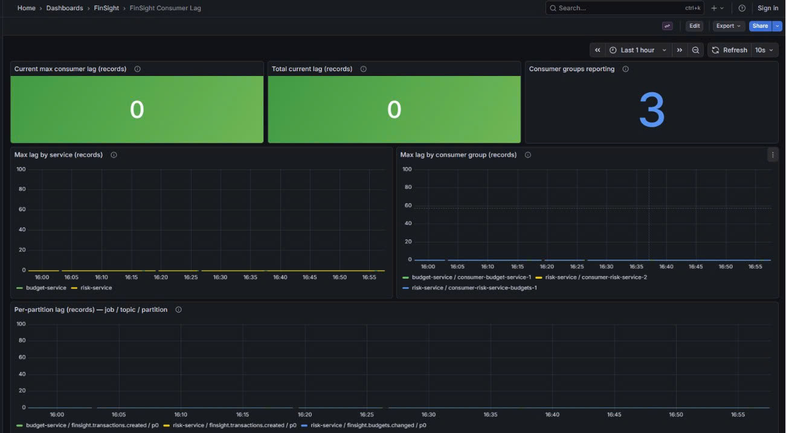

<picture>
  <source media="(prefers-color-scheme: dark)" srcset="docs/images/vernfy-logo-dark.svg">
  
</picture>

[](https://github.com/Trieu-hub/finsight-platform/actions/workflows/ci.yml)

**Financial Intelligence & Risk Monitoring Platform** — a Spring Boot 4 / Java 21
microservice monorepo.

Vernfy is an event-driven finance platform: users record transactions and budgets over a
REST API, and an asynchronous Kafka backbone feeds a **risk-intelligence** service that
derives risk alerts, behavioral insights, and anomalies from the activity. Each service owns
its own database and the only synchronous fan-out is a read-only BFF; all other cross-service
coupling is asynchronous over Kafka.

> **Status:** working MVP with a rule-based intelligence layer. The intelligence is
> **rule-based, not ML**. See [Roadmap / not yet built](#roadmap--not-yet-built) for what is
> intentionally absent.

## Documentation

| Doc | Contents |
|---|---|
| [`docs/architecture.md`](docs/architecture.md) | Service boundaries, request/event flow, diagrams |
| [`docs/event-catalog.md`](docs/event-catalog.md) | Every Kafka event: producer, consumers, payloads |
| [`docs/intelligence.md`](docs/intelligence.md) | Risk rules, insights, anomalies — triggers & metrics |
| [`docs/runbook.md`](docs/runbook.md) | Startup, compose workflow, Kafka/Prometheus/Grafana verification, troubleshooting |
| [`docs/deploy.md`](docs/deploy.md) | Production deployment on a single VPS (Caddy, TLS, SOPS secrets) |
| [`docs/security/jwt-key-rotation.md`](docs/security/jwt-key-rotation.md) | Zero-downtime RS256 signing-key rotation |
| [`docs/ADR-0004-budget-utilization-via-events.md`](docs/ADR-0004-budget-utilization-via-events.md) | Why budget utilization is event-driven (and its accepted drift) |
| [`services/api-gateway/docs/`](services/api-gateway/docs/) | ADR-0001/0002/0003/0005 — gateway contract, identity freeze, BFF token relay, RS256 |
| [`docs/brand.md`](docs/brand.md) | Logo files, palette, and the reasoning behind the mark |
| [`docs/unit-testing/unit-testing-1.txt`](docs/unit-testing/unit-testing-1.txt) | Full test-suite catalog — every test class (unit vs integration), count, and what it verifies (434 tests across 9 services) |

## Tech stack

- **Java 21**, **Spring Boot 4.0.6**, Spring Security, Spring Data JPA
- **MySQL 8** — one shared instance, one logical database per service
- **Redis** — used by auth-service (refresh tokens + brute-force lockout)
- **Kafka** (single-node KRaft broker) — asynchronous event backbone
- **Flyway** — schema ownership (`ddl-auto: validate`)
- **JWT** (RS256) — signed by auth-service, the only holder of the private key; every service
  verifies with the public key alone, discovered by `kid` from a published JWK Set
- **springdoc / OpenAPI** — API docs on the user-facing REST services
- **Micrometer + Prometheus + Grafana** — metrics and dashboards
- **Docker / Docker Compose**, **GitHub Actions** (CI), **Testcontainers** (integration tests)
- **React 19 + TypeScript + Vite + TailwindCSS** — single-page web client (see [Web frontend](#web-frontend))

## Architecture summary

```
                 ┌──────────────┐
   Client ─────▶ │ api-gateway  │  edge JWT validation + routing
                 │   :8080      │
                 └──────┬───────┘
        ┌───────────┬───┴────┬────────────┬─────────────┐
        ▼           ▼        ▼            ▼             ▼
   auth :8081  user :8082  tx :8083   budget :8084  dashboard :8085
   auth_db     user_db     transaction_db budget_db   (no DB, BFF)
        │                     │            │   ▲          │ calls user/tx/budget
        │                     │            │   │          ▼ (REST, relays JWT)
     (Redis)                  │            │   │
                              ▼            ▼   │
                       ┌───────────── Kafka ───────────────┐
                       │ finsight.transactions.created      │
                       │ finsight.budgets.changed           │
                       │ finsight.risk.detected             │
                       └───────────────┬───────────────────┘
                                       ▼
                                 risk-service :8086  ──▶ risk_db
                                 (risk rules · insights · anomalies)
                                       │ produces finsight.risk.detected
                                       ▼
                          notification-service :8087  ──▶ notification_db
                          (in-app alerts materialized from RiskDetected)

                          analytics-service :8088  ──▶ analytics_db
                          (per-month rollup from TransactionCreated; AI monthly summary)
```

- **Synchronous**: client → gateway → owning service over HTTP/REST; the dashboard BFF fans out
  to user/transaction/budget, relaying the caller's JWT (fail-fast). The BFF → user-service hop
  is **gRPC** (`finsight.user.v1.UserProfileService`, bearer token relayed as call metadata) —
  the platform's one internal gRPC call; transaction and budget stay REST. No other business
  service calls another at runtime.
- **Asynchronous** (Kafka): transaction-service produces `TransactionCreated`; budget-service,
  risk-service **and analytics-service** consume it; budget-service produces `BudgetChanged`
  (consumed by risk-service); risk-service produces `RiskDetected`, consumed by
  notification-service, which materializes per-user in-app notifications. analytics-service
  folds `TransactionCreated` into a per-month rollup read model.

Full diagrams (Mermaid) are in [`docs/architecture.md`](docs/architecture.md).

**Design rules** (enforced in code): no runtime cross-service calls except the dashboard BFF;
`userId` is read only from the JWT; Flyway owns every schema; every service validates the JWT
locally (the gateway stays removable); `risk-service` is internal (no JWT stack, not behind the
gateway).

## Service inventory

| Service | Port | Database | Inbound | Responsibility |
|---|---|---|---|---|
| `api-gateway` | 8080 | – | HTTP | Edge routing + JWT validation (RS256/issuer/audience) |
| `auth-service` | 8081 | `auth_db` | HTTP | Register, login, refresh, account lockout; Redis-backed tokens |
| `user-service` | 8082 | `user_db` | HTTP | User profile data |
| `transaction-service` | 8083 | `transaction_db` | HTTP | Transactions (INCOME/EXPENSE/TRANSFER), categories, wallets (accounts + balances), summaries; **produces** `TransactionCreated` |
| `budget-service` | 8084 | `budget_db` | HTTP, Kafka | Budget definitions + utilization; **consumes** `TransactionCreated`, **produces** `BudgetChanged` |
| `dashboard-service` | 8085 | _(none, BFF)_ | HTTP | Read-only aggregation over user/transaction/budget; relays JWT; fail-fast |
| `risk-service` | 8086 (internal) | `risk_db` | Kafka | Risk rules, behavioral insights, anomaly detection; **consumes** `TransactionCreated` + `BudgetChanged`, **produces** `RiskDetected`; read APIs. Port not host-published (SE-2) |
| `notification-service` | 8087 | `notification_db` | HTTP, Kafka | In-app notifications; **consumes** `RiskDetected`; user-scoped read/mark-read API; optional **LLM narrator** (OpenAI-compatible, Groq free tier by default, off unless configured) |
| `analytics-service` | 8088 | `analytics_db` | HTTP, Kafka | Per-user monthly **rollup read model**; **consumes** `TransactionCreated`; overview / categories / forecast APIs; optional **AI monthly summary** (OpenAI-compatible, Groq free tier by default, off unless configured) |

## Databases

One **MySQL 8** instance hosts seven logical databases (DB-per-service isolation):

| Database | Owner | Notable tables |
|---|---|---|
| `auth_db` | auth-service | users, roles, refresh-token records |
| `user_db` | user-service | user_profiles |
| `transaction_db` | transaction-service | transactions, categories |
| `budget_db` | budget-service | budgets (incl. `spent_amount`), `processed_events` (idempotency inbox) |
| `risk_db` | risk-service | `risk_alerts`, `observed_expenses`, `insights`, `budget_snapshots`, `anomalies` |
| `notification_db` | notification-service | `notifications`, `processed_events` (idempotency inbox) |
| `analytics_db` | analytics-service | `monthly_category_rollup`, `processed_events` (idempotency inbox) |

`dashboard-service` owns no database. **Redis** backs only auth-service.

## Kafka topics

Single-node KRaft broker; JSON without type headers; keyed by `userId`; at-least-once delivery
with idempotent consumers. Full payloads in [`docs/event-catalog.md`](docs/event-catalog.md).

| Topic | Producer | Consumer(s) |
|---|---|---|
| `finsight.transactions.created` | transaction-service | budget-service, risk-service, analytics-service |
| `finsight.budgets.changed` | budget-service | risk-service |
| `finsight.risk.detected` | risk-service | notification-service |

## Implemented intelligence

All in **risk-service**, derived from the `observed_expenses` read-model fed by the
`TransactionCreated` consumer — **no ML, no prediction**, simple counts/sums/averages only.
Triggers, severities, persistence, and metrics are detailed in
[`docs/intelligence.md`](docs/intelligence.md).

**Risk Monitoring** → persisted to `risk_alerts`, published as `RiskDetected`, exposed at
`GET /api/v1/risks`; metric `finsight.risk.events.detected{type,severity}`:

| Rule | Trigger | Severity |
|---|---|---|
| `HIGH_AMOUNT_EXPENSE` | A single EXPENSE ≥ 10,000,000 | HIGH |
| `RAPID_SPENDING` | 5th EXPENSE for a user within a 10-minute window | MEDIUM |
| `LARGE_DAILY_SPEND` | Daily EXPENSE total crosses above 20,000,000 | HIGH |

**Behavioral Insights** → persisted to `insights` (one per scope per month), exposed at
`GET /api/v1/insights`; metric `finsight.insights.generated{type}`:

| Insight | Trigger |
|---|---|
| `SPENDING_INCREASE` | Current-month expenses ≥ +30% vs previous month |
| `CATEGORY_SURGE` | Current-month category expenses ≥ +50% vs previous month |
| `BUDGET_RISK` | A matching budget's utilization exceeds 80% while its period is open |
| `LOW_SAVINGS_RATE` | Month with positive income where expenses reach ≥ 80% of income |

**Anomaly Detection** → persisted to `anomalies`, exposed at `GET /api/v1/anomalies`; metric
`finsight.anomalies.detected{type}`:

| Anomaly | Trigger |
|---|---|
| `UNUSUAL_TRANSACTION_AMOUNT` | An EXPENSE ≥ 3× the user's average historical expense, with ≥ 10 prior EXPENSE transactions |

> The risk-service read APIs (`/api/v1/risks`, `/api/v1/insights`, `/api/v1/anomalies`) are an
> internal/admin surface — unauthenticated by design, not behind the gateway, and **not published
> to the host** (reachable only on the compose network at `risk-service:8086`, SE-2).

## Observability stack

Every service exposes Micrometer metrics at `/actuator/prometheus` and liveness/readiness
probes at `/actuator/health/{liveness,readiness}`.

- **Prometheus** — <http://localhost:9090> — scrapes all nine services every 15s
  (`docker/prometheus/prometheus.yml`); check *Status → Targets*.
- **Grafana** — <http://localhost:3000> — auto-provisions the Prometheus datasource and four
  dashboards (folder **FinSight**, from `docker/grafana/provisioning/`):
  - **FinSight Platform Overview** — request rate, 5xx rate, p95 latency, JVM heap, GC, CPU.
  - **FinSight Event Pipeline** — budget consumer `processed` / `duplicate` / `ignored` / `failed`.
  - **FinSight Risk** — detected risks by type and severity.
  - **FinSight Consumer Lag** — Kafka consumer lag per service / group / partition.
- **Alertmanager** — <http://localhost:9093> — receives firing alerts from Prometheus. Rules in
  `docker/prometheus/alerts.yml`: service down, 5xx rate, JVM heap, Kafka consumer lag, dashboard
  circuit-breaker open. Locally no delivery channel is configured (a Slack/email/webhook stub is in
  `docker/alertmanager/alertmanager.yml`); **production delivers firing alerts to Telegram**, with
  the bot token rendered to tmpfs at start so it never lands on disk.

> Dev-stack posture, on purpose: Grafana allows anonymous admin and the scrape endpoint is
> unauthenticated — acceptable on a local compose network, not a production posture.

### Dashboard screenshots

Live dashboards from the running stack (under [`docs/images/`](docs/images/)):






## Web frontend

A single-page React client (in [`web/`](web/)) consumes the platform's REST API through the
api-gateway. It is a thin presentation layer — all business logic, validation, and authorization
stay in the backend.

- **Vite + React 19 + TypeScript**, **React Router**, **Axios**, **TailwindCSS**.
- **JWT auth**: the token from `POST /api/v1/auth/login` is stored client-side and attached to
  every request by an Axios interceptor; a `401` clears it and redirects to `/login`. Protected
  routes are gated client-side for UX only — the backend remains the security boundary.
- **Pages**: Login / Register, Dashboard (income / expense / balance + recent activity + budget
  progress), Transactions (history newest-first, filterable by month — current month by default —
  + create, incl. wallet selection and wallet-to-wallet transfers), Budgets (utilization bars,
  showing the current period's budgets by default with a toggle to reveal expired ones, and an
  instant popup the moment a new expense pushes its budget over the limit), Wallets (accounts with
  live balances, create / delete), Analytics (month-over-month overview, spend forecast, top movers,
  category breakdown, and an AI/template monthly summary — served by analytics-service), Admin
  console (RBAC user management, ROLE_ADMIN only).
- **Bilingual & themed**: a header toggle switches between English and Vietnamese (all copy and
  category names localized) and between light/dark colour themes; both choices persist in the
  browser.
- **Notification bell**: a header bell shows an unread badge and opens a dropdown of risk alerts
  (severity-coloured) with mark-read / mark-all-read — the in-app surface for what
  notification-service materializes from `RiskDetected`. Alerts arrive **live over SSE**: the Kafka
  consumer that writes a notification also pushes it to every open connection that user has, so it
  appears immediately. A long-interval poll of `GET /api/v1/notifications/unread-count` remains as
  a fallback.
- **Dev proxy**: Vite forwards `/api` → `http://localhost:8080`, so the browser stays
  same-origin and no backend CORS configuration is needed (a reverse proxy plays this role in
  production).

```bash
npm install --prefix web
npm run dev --prefix web        # http://localhost:5173 (needs the stack running on :8080)
npm run build --prefix web      # type-check + production build to web/dist
```

## Local startup (Docker Compose)

The root `docker-compose.yml` builds all nine services and starts MySQL, Redis, Kafka,
Prometheus, and Grafana. auth-service holds the JWT signing key; the rest get the public key.

**1. Secrets (`.env`) — required first.** No secrets live in compose; they are interpolated
from a gitignored `.env`. Compose refuses to start (clear `set X in .env` message) if any are
missing.

```bash
cp .env.example .env
./scripts/gen-jwt-keys.sh          # prints an RS256 keypair; paste into JWT_PRIVATE_KEY / JWT_PUBLIC_KEY
# Then fill in: MYSQL_ROOT_PASSWORD and the seven *_DB_PASSWORD values
# (AUTH/USER/TRANSACTION/BUDGET/RISK/NOTIFICATION/ANALYTICS). Commands are in the file.
```

**2. Start the stack:**

```bash
docker compose up --build -d     # build images + start everything
docker compose ps                # watch readiness-gated startup
docker compose logs -f risk-service
docker compose down              # stop  (add -v to also drop MySQL/Prometheus/Grafana volumes)
```

**3. Verify health** (services are readiness-gated via healthchecks + `depends_on`):

```bash
# risk-service (8086) is not host-published (internal-only); check it via `docker compose ps`.
for p in 8080 8081 8082 8083 8084 8085 8087 8088; do
  curl -fsS http://localhost:$p/actuator/health/readiness && echo " <- $p OK"
done
```

On the **first** MySQL start, init scripts create the seven databases and one least-privilege
user per service (`auth_user`, `user_user`, `transaction_user`, `budget_user`, `risk_user`,
`notification_user`, `analytics_user`) — each service connects as its own user, never `root`. Kafka/MySQL/Redis ports are not published
to the host; see [`docs/runbook.md`](docs/runbook.md) for Kafka/Prometheus/Grafana verification
and troubleshooting.

> Init scripts run only against an empty data dir. If you have an existing `mysql_data` volume
> from before the risk-service database was added, recreate it with `docker compose down -v`.

### Run / test a single service

```bash
cd services/<service>
./mvnw spring-boot:run     # mvnw.cmd on Windows; needs a DB and (for JWT services) JWT_PUBLIC_KEY
./mvnw verify              # unit + Testcontainers integration tests (Docker required)
```

## Continuous Integration

**Build & test** (`.github/workflows/ci.yml`) — on each `pull_request` and push to `main`, a single
matrix job fans out across all **nine** modules (`api-gateway`, `auth-service`, `user-service`,
`transaction-service`, `budget-service`, `dashboard-service`, `risk-service`,
`notification-service`, `analytics-service`):

- **JDK 21** (Temurin) with the Maven (`~/.m2`) cache enabled.
- Each module runs `mvn -B -ntp verify` — unit **and** Testcontainers integration tests in one
  pass (MySQL/Kafka containers via Testcontainers; the runner ships with Docker).
- `fail-fast` is off, so one run reports every failing service; failing modules upload their
  Surefire reports as artifacts.

**Security** (`.github/workflows/security.yml`) — same triggers, plus a weekly schedule so a
newly-disclosed CVE turns the build red even when no code changed:

- **Secret scan** — gitleaks over the **full git history**, not just the tip. Blocking: any finding
  fails the job, so a leaked credential cannot merge.
- **Dependency scan** — Trivy filesystem scan across every `pom.xml` and `web/package-lock.json`,
  HIGH/CRITICAL and `--ignore-unfixed`. Report-only (`continue-on-error`) — findings surface in the
  log and Dependabot opens the PRs that fix them.
- **Dependabot** (`.github/dependabot.yml`) — weekly, grouped, across the nine Maven modules, npm
  `web/`, and the workflows themselves.

> There is no aggregator pom; the matrix is what builds "all services" in CI. Adding a service means
> adding it to the matrix.
>
> The frontend is **not** covered by CI — see [Roadmap / not yet built](#roadmap--not-yet-built).

## End-to-end validation

The full event-driven path is implemented and traceable in the repo (code + config), and the
runtime is captured by the committed Grafana dashboard screenshots above.

| Stage | Status | Evidence in repo |
|---|---|---|
| Expense creation (REST) | ✅ implemented | `transaction-service` |
| Kafka event published (`TransactionCreated`) | ✅ implemented | `transaction-service` producer → `finsight.transactions.created` |
| Risk detection executed | ✅ implemented | `risk-service` rules ([`docs/intelligence.md`](docs/intelligence.md)) |
| Database updated | ✅ implemented | `risk_db.risk_alerts` (Flyway-owned) |
| Prometheus metrics updated | ✅ implemented | `/actuator/prometheus` · `finsight.risk.events.detected{type,severity}` |
| Grafana dashboard updated | ✅ provisioned | `docker/grafana/provisioning/` (4 dashboards) |
| CI pipeline passing | ✅ workflow + badge | [`.github/workflows/ci.yml`](.github/workflows/ci.yml) |
| Runtime screenshots committed | ✅ committed | `docs/images/` (4 Grafana dashboards, embedded above) |

## Roadmap / not yet built

These are **absent from the codebase** — do not assume they exist:

- **External notification delivery to end users** — notification-service creates **in-app**
  notifications from `RiskDetected` and pushes them live over SSE; email/push/webhook delivery to
  users is not built. (Two things that *are* built and often mistaken for absent: an optional
  **LLM message narrator** — OpenAI-compatible, default Groq free tier, off by default with a
  rule-based fallback; and **Telegram delivery for Prometheus alerts**, which is an operator
  channel, not a user-facing one.)
- **ML-based intelligence** — current rules are deterministic and threshold-based.
- **An orchestrated deployment target** (Kubernetes/ECS) **and a managed secrets store**
  (Vault/KMS). The live demo runs Docker Compose on a single VPS behind Caddy with TLS; secrets
  are **SOPS/age-encrypted at rest** and injected into the process environment at launch, which
  is a real improvement over a plaintext `.env` but still not a managed secrets manager.
- **SAST** (CodeQL/Semgrep/SpotBugs) — secret and dependency scanning *are* wired
  (see [Continuous Integration](#continuous-integration)); static analysis of the code is not.
- **Load/performance testing** — no k6/Gatling/JMeter suite and no published baseline.
- **Whole-stack E2E in CI** — the matrix builds and tests each service in isolation; nothing
  exercises browser → gateway → Kafka → risk end to end on every PR.
- **Frontend CI** — `web/` is not built, linted, or type-checked by any workflow, and has no
  automated tests.
- **Log aggregation** — metrics (Prometheus) and traces (Tempo) are wired; there is no Loki/ELK,
  so log inspection is per-container.
- **Continuous deployment** — deployment is a manual `ssh` + `scripts/prod-compose.sh up -d --build`;
  no workflow deploys on merge.
