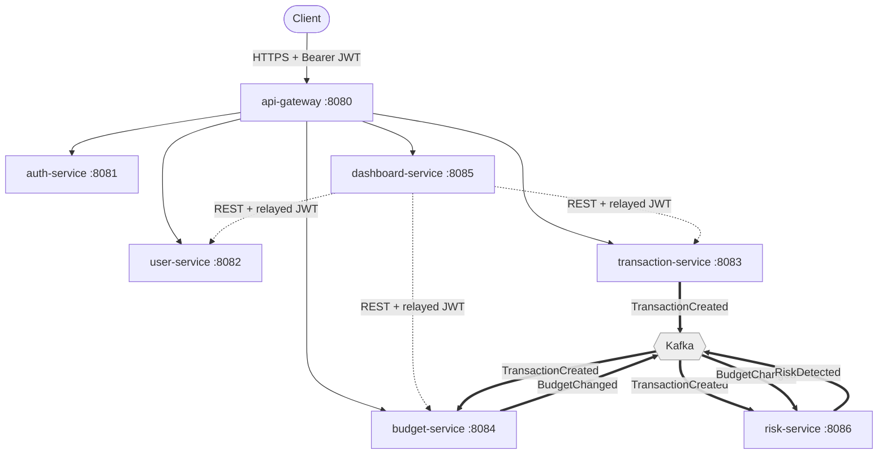
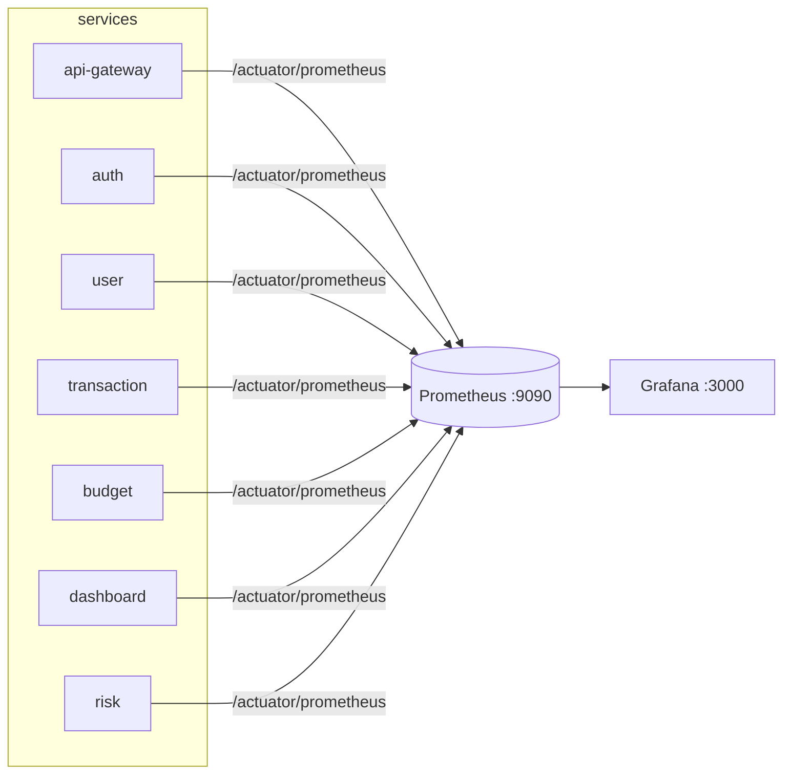
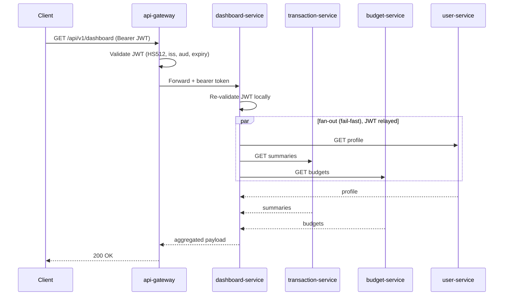
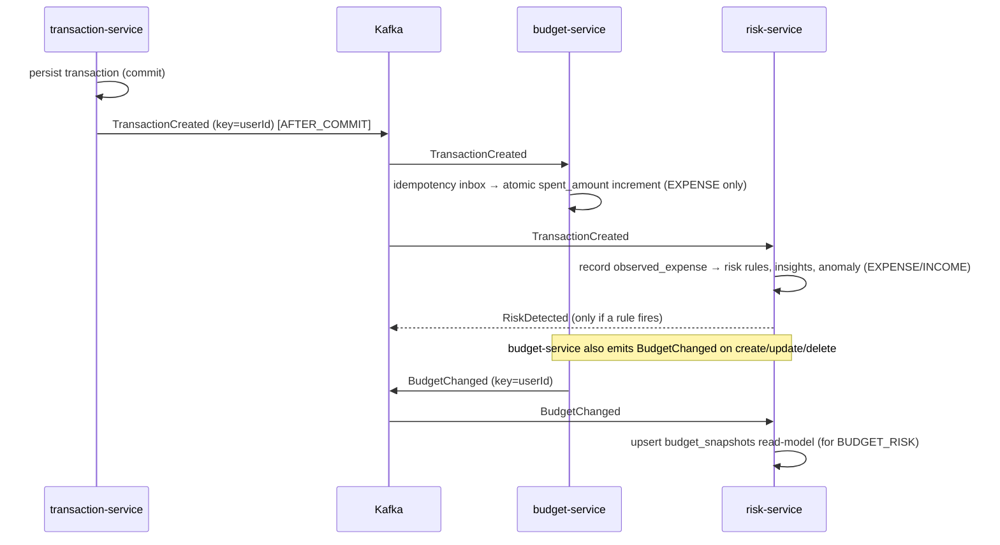

# FinSight — Architecture

_Last updated: 2026-06-14 · Source of truth: the code under `services/` and `docker-compose.yml`._

FinSight is a Spring Boot 4 / Java 21 microservice monorepo. Each service owns its own
database and never calls another business service at runtime — the only synchronous fan-out
is the dashboard BFF, and all other cross-service coupling is asynchronous over Kafka.

This document describes the system **as built**. Anything not implemented is called out
explicitly under [Not yet built](#not-yet-built).

---

## 1. Service boundaries

| Service | Port | Owns DB | Inbound | Responsibility |
|---|---|---|---|---|
| `api-gateway` | 8080 | – | HTTP (edge) | Path-prefix routing + edge JWT validation (HS512/issuer/audience); forwards the bearer token downstream |
| `auth-service` | 8081 | `auth_db` | HTTP | Register, login, refresh, account lockout; Redis-backed refresh tokens + lockout counters |
| `user-service` | 8082 | `user_db` | HTTP | User profile data |
| `transaction-service` | 8083 | `transaction_db` | HTTP | Transactions (INCOME/EXPENSE), categories, summaries; **produces** `TransactionCreated` |
| `budget-service` | 8084 | `budget_db` | HTTP, Kafka | Budget definitions + utilization (`spent_amount`); **consumes** `TransactionCreated`, **produces** `BudgetChanged` |
| `dashboard-service` | 8085 | _(none, BFF)_ | HTTP | Read-only aggregation over user/transaction/budget; relays the caller's JWT; fail-fast |
| `risk-service` | 8086 | `risk_db` | Kafka | Risk rules, behavioral insights, anomaly detection; **consumes** `TransactionCreated` + `BudgetChanged`, **produces** `RiskDetected`; read APIs for risks/insights/anomalies |
| `notification-service` | 8087 | `notification_db` | HTTP, Kafka | In-app notifications; **consumes** `RiskDetected`, idempotency inbox; user-scoped read/mark-read API |

Shared infrastructure (not application services): a single **MySQL 8** instance hosting six
logical databases, **Redis** (used only by auth-service), a single-node **Kafka** (KRaft)
broker, **Prometheus**, and **Grafana**.

**Design rules enforced in code:**
- No runtime cross-service calls between business services. Only `dashboard-service` calls
  others (over REST, relaying the JWT). Everything else is Kafka.
- `userId` is read **only** from the JWT, never from a request body.
- Flyway owns every schema; Hibernate runs `ddl-auto: validate`.
- Every service validates the JWT itself, so the gateway stays removable.
- `risk-service` carries **no JWT stack** and is **not** exposed through the gateway; its read
  APIs are an internal/admin surface.

### Risk-service API visibility (no OpenAPI/Swagger — by design)

The six user-facing services ship springdoc/OpenAPI; **risk-service deliberately does not**, and
its read endpoints are documented here and in [intelligence.md](intelligence.md) instead of via a
live `/v3/api-docs`:

| Endpoint | Returns |
|---|---|
| `GET /api/v1/risks`, `GET /api/v1/risks/{id}` | persisted risk alerts |
| `GET /api/v1/insights` | generated behavioral insights |
| `GET /api/v1/anomalies` | detected anomalies |

Why doc-only rather than adding springdoc:
- **It is not a public/product API.** risk-service is internal — no JWT stack, not behind the
  gateway, not host-published. An OpenAPI/Swagger surface would primarily widen the unauthenticated
  attack surface (the springdoc UI/`api-docs` paths are permit-listed on the other services) for an
  admin/debug read API with no external consumers.
- **Low churn, fully covered.** The three endpoints are stable, read-only list/get shapes already
  specified in [event-catalog.md](event-catalog.md) (record fields) and [intelligence.md](intelligence.md)
  (semantics), so a generated spec would add a dependency and a permit-list entry without new value.
- If risk-service is ever fronted by the gateway for external consumers, add springdoc then (same
  `OpenApiConfig` + SecurityConfig permit-list pattern the other services use).

`==>` is asynchronous (Kafka); `-->`/`-.->` is synchronous (HTTP/REST).
`risk-service` is not behind the gateway (no `RISK_SERVICE_URI` route).

---

## 2. Databases

One MySQL 8 instance, one logical database per owning service (DB-per-service isolation):

| Database | Owner | Notable tables |
|---|---|---|
| `auth_db` | auth-service | users, roles, refresh-token records |
| `user_db` | user-service | user_profiles |
| `transaction_db` | transaction-service | transactions, categories |
| `budget_db` | budget-service | budgets (incl. `spent_amount`), `processed_events` (idempotency inbox) |
| `risk_db` | risk-service | `risk_alerts`, `observed_expenses`, `insights`, `budget_snapshots`, `anomalies` |
| `notification_db` | notification-service | `notifications`, `processed_events` (idempotency inbox) |

`dashboard-service` owns **no** database — it composes other services' data on read.
**Redis** backs only auth-service (refresh tokens + brute-force lockout counters).

Schema ownership is Flyway-only. risk-service's migrations, for example, run `V1…V8`
(`risk_alerts` → `observed_expenses` → `insights` → category/currency → subject discriminator
→ `budget_snapshots` → income discriminator → `anomalies`).

---

## 3. Kafka topics & event ownership

Single-node KRaft broker (`apache/kafka:3.9.1`), replication factor 1, one partition per
topic. Events are JSON **without** type headers (language-neutral wire format), keyed by
`userId` so each user's events stay ordered on one partition. Temporal fields are ISO-8601
strings.

| Topic | Producer (owner) | Consumer(s) | Event type |
|---|---|---|---|
| `finsight.transactions.created` | transaction-service | budget-service, risk-service | `TransactionCreated` |
| `finsight.budgets.changed` | budget-service | risk-service | `BudgetChanged` |
| `finsight.risk.detected` | risk-service | notification-service | `RiskDetected` |

Each topic is owned by exactly one producer. `RiskDetected` is consumed by notification-service,
which materializes per-user in-app notifications (idempotent inbox). Full payloads are
in [event-catalog.md](event-catalog.md).

**Delivery semantics:** at-least-once. Producers publish `@TransactionalEventListener(AFTER_COMMIT)`
(only after the DB commit; a failed send is logged, not rethrown — the accepted dual-write gap,
see [ADR-0004](ADR-0004-budget-utilization-via-events.md)). Consumers are made idempotent:
budget-service via a `processed_events` inbox; risk-service by keying rows on source ids
(the transaction event id for `observed_expenses`/`anomalies`; the budget id for `budget_snapshots`).

---

## 4. Observability stack

Every Spring Boot service exposes Micrometer metrics at `/actuator/prometheus` (permit-listed,
unauthenticated — acceptable for the local stack only) and liveness/readiness probes at
`/actuator/health/{liveness,readiness}`.

- **Prometheus** (`:9090`) scrapes all eight services every 15s (static compose-DNS targets in
  `docker/prometheus/prometheus.yml`).
- **Grafana** (`:3000`, anonymous admin in the dev stack) auto-provisions the Prometheus
  datasource and three dashboards from `docker/grafana/provisioning/`:
  - **FinSight Platform Overview** — request rate, 5xx rate, p95 latency, JVM heap, GC, CPU.
  - **FinSight Event Pipeline** — budget consumer `processed`/`duplicate`/`ignored`/`failed`.
  - **FinSight Risk** — detected risks by type and severity.

Structured logging: native Boot 4 ECS JSON on stdout, toggled by
`LOGGING_STRUCTURED_FORMAT_CONSOLE=ecs` (set in compose for api-gateway, transaction-service,
and dashboard-service); `correlationId` (MDC) and `service.name` are included automatically.

---

## 5. Request flow (synchronous)

A typical authenticated read through the dashboard BFF:

Auth/login goes `Client → api-gateway → auth-service` (public routes skip JWT validation).
Direct resource calls (`/api/v1/transactions`, `/api/v1/budgets`, …) route gateway → the owning
service, which validates the JWT itself.

---

## 6. Event flow (asynchronous)

What each consumer does with `TransactionCreated`:
- **budget-service** — applies EXPENSE amounts to every matching budget's `spent_amount`
  (atomic SQL increment), deduped via the `processed_events` inbox.
- **risk-service** — records the transaction into `observed_expenses` (EXPENSE via the rule
  engine; INCOME via the insight service), then evaluates the risk rules, behavioral insights,
  and the anomaly rule. See [intelligence.md](intelligence.md).

---

## 7. Not yet built

These are **absent from the codebase** and must not be implied as present:

- **gRPC** — no proto, no dependencies; all synchronous calls are REST.
- **External notification delivery** — notification-service creates **in-app** notifications from
  `RiskDetected`; email/push/webhook delivery and an LLM-backed message narrator are not built.
- **Transaction `TRANSFER`** — only INCOME/EXPENSE exist (`walletId` is scaffolded, unused).
- **Edge rate limiting**, **distributed tracing**, **alerting** (Prometheus has no alert rules).
- **Asymmetric JWT signing** — a single shared HMAC secret is used platform-wide.
- **Transactional outbox** — the AFTER_COMMIT dual-write gap is accepted (ADR-0004).
