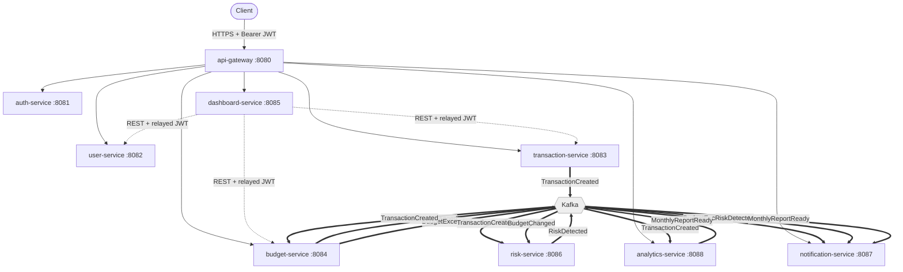
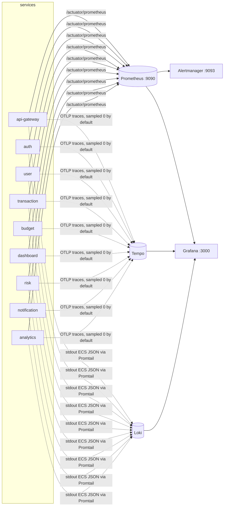
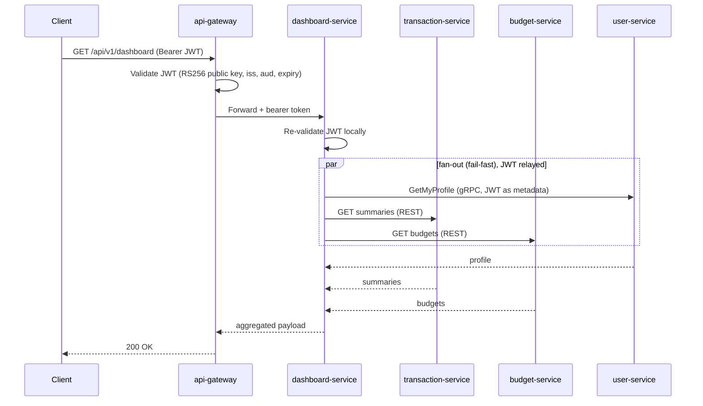
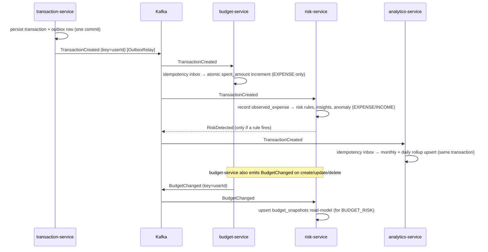

# FinSight — Architecture

_Last updated: 2026-08-17 · Source of truth: the code under `services/` and `docker-compose.yml`._

FinSight is a Spring Boot 4 / Java 21 microservice monorepo. Each service owns its own
database and never calls another business service at runtime — the only synchronous fan-out
is the dashboard BFF, and all other cross-service coupling is asynchronous over Kafka.

This document describes the system **as built**. Anything not implemented is called out
explicitly under [Not yet built](#not-yet-built).

---

## 1. Service boundaries

| Service | Port | Owns DB | Inbound | Responsibility |
|---|---|---|---|---|
| `api-gateway` | 8080 | – | HTTP (edge) | Path-prefix routing + edge JWT validation (RS256/issuer/audience); forwards the bearer token downstream |
| `auth-service` | 8081 | `auth_db` | HTTP | Register, login, refresh, account lockout; Redis-backed refresh tokens + lockout counters |
| `user-service` | 8082 | `user_db` | HTTP | User profile data |
| `transaction-service` | 8083 | `transaction_db` | HTTP | Transactions (INCOME/EXPENSE), categories, summaries, CSV statement import; **produces** `TransactionCreated` |
| `budget-service` | 8084 | `budget_db` | HTTP, Kafka | Budget definitions + utilization (`spent_amount`); **consumes** `TransactionCreated`, **produces** `BudgetChanged` |
| `dashboard-service` | 8085 | _(none, BFF)_ | HTTP | Read-only aggregation over user/transaction/budget; relays the caller's JWT; fail-fast |
| `risk-service` | 8086 | `risk_db` | Kafka | Risk rules, behavioral insights, anomaly detection, recurring charges; **consumes** `TransactionCreated` + `BudgetChanged`, **produces** `RiskDetected`; read APIs for risks/insights/anomalies/recurring |
| `notification-service` | 8087 | `notification_db` | HTTP, Kafka | In-app notifications; **consumes** `RiskDetected` + `BudgetExceeded` + `MonthlyReportReady`, idempotency inbox; user-scoped read/mark-read API; delivery channels (SSE, web push, email, signed webhook) with per-user digest batching |
| `analytics-service` | 8088 | `analytics_db` | HTTP, Kafka | Monthly + daily **rollup read model**; **consumes** `TransactionCreated`, **produces** `MonthlyReportReady`; overview / categories / forecast / summary APIs; optional LLM monthly summary and an optional nightly-trained **spend forecast model** (both off by default) |

Shared infrastructure (not application services): a single **MySQL 8** instance hosting seven
logical databases, **Redis** (used only by auth-service), a single-node **Kafka** (KRaft)
broker, and the observability stack — **Prometheus**, **Alertmanager**, **Grafana**, **Tempo**
(traces) and **Loki** + **Promtail** (logs), all behind the `monitoring` compose profile so the
application stack can be started without them.

**Design rules enforced in code:**
- No runtime cross-service calls between business services. Only `dashboard-service` calls
  others (over REST, relaying the JWT). Everything else is Kafka.
- `userId` is read **only** from the JWT, never from a request body.
- Flyway owns every schema; Hibernate runs `ddl-auto: validate`.
- Every service validates the JWT itself, so the gateway stays removable.
- `risk-service` carries **no JWT stack** and is **not** exposed through the gateway; its read
  APIs are an internal/admin surface.

### Risk-service API visibility (no OpenAPI/Swagger — by design)

The seven user-facing services ship springdoc/OpenAPI; **risk-service deliberately does not**, and
its read endpoints are documented here and in [intelligence.md](intelligence.md) instead of via a
live `/v3/api-docs`:

| Endpoint | Returns |
|---|---|
| `GET /api/v1/risks`, `GET /api/v1/risks/{id}` | persisted risk alerts |
| `GET /api/v1/insights` | generated behavioral insights |
| `GET /api/v1/anomalies` | detected anomalies |
| `GET /api/v1/recurring` | detected recurring charge series |

Why doc-only rather than adding springdoc:
- **It is not a public/product API.** risk-service is internal — no JWT stack, not behind the
  gateway, not host-published. An OpenAPI/Swagger surface would primarily widen the unauthenticated
  attack surface (the springdoc UI/`api-docs` paths are permit-listed on the other services) for an
  admin/debug read API with no external consumers.
- **Low churn, fully covered.** The four endpoints are stable, read-only list/get shapes already
  specified in [event-catalog.md](event-catalog.md) (record fields) and [intelligence.md](intelligence.md)
  (semantics), so a generated spec would add a dependency and a permit-list entry without new value.
- If risk-service is ever fronted by the gateway for external consumers, add springdoc then (same
  `OpenApiConfig` + SecurityConfig permit-list pattern the other services use).

```mermaid
graph TB
  client([Client])
  gw[api-gateway :8080]
  auth[auth-service :8081]
  user[user-service :8082]
  tx[transaction-service :8083]
  bud[budget-service :8084]
  dash[dashboard-service :8085]
  risk[risk-service :8086]
  notif[notification-service :8087]
  an[analytics-service :8088]

  client -->|HTTPS + Bearer JWT| gw
  gw --> auth
  gw --> user
  gw --> tx
  gw --> bud
  gw --> dash
  gw --> notif
  gw --> an
  dash -.->|REST + relayed JWT| user
  dash -.->|REST + relayed JWT| tx
  dash -.->|REST + relayed JWT| bud

  tx ==>|TransactionCreated| K{{Kafka}}
  bud ==>|BudgetChanged| K
  bud ==>|BudgetExceeded| K
  K ==>|TransactionCreated| bud
  K ==>|TransactionCreated| risk
  K ==>|TransactionCreated| an
  K ==>|BudgetChanged| risk
  K ==>|BudgetExceeded| notif
  risk ==>|RiskDetected| K
  K ==>|RiskDetected| notif
  an ==>|MonthlyReportReady| K
  K ==>|MonthlyReportReady| notif

  classDef infra fill:#eee,stroke:#999;
  class K infra
```

`==>` is asynchronous (Kafka); `-->`/`-.->` is synchronous (HTTP/REST, plus gRPC for
dashboard→user-service).
`risk-service` is not behind the gateway (no `RISK_SERVICE_URI` route).

---

## 2. Databases

One MySQL 8 instance, one logical database per owning service (DB-per-service isolation):

| Database | Owner | Notable tables |
|---|---|---|
| `auth_db` | auth-service | users (incl. `last_login_at`), roles, refresh-token records |
| `user_db` | user-service | user_profiles |
| `transaction_db` | transaction-service | transactions, categories, `wallets`, `outbox` (transactional outbox, incl. `correlation_id`) |
| `budget_db` | budget-service | budgets (incl. `spent_amount`), `processed_events` (idempotency inbox) |
| `risk_db` | risk-service | `risk_alerts`, `observed_expenses`, `insights`, `budget_snapshots`, `anomalies`, `recurring_series` |
| `notification_db` | notification-service | `notifications`, `processed_events` (idempotency inbox), `push_subscriptions`, `notification_preferences` (email/webhook destination + digest mode) |
| `analytics_db` | analytics-service | `monthly_category_rollup`, `daily_category_rollup` (the day-grained series the forecast learns from), `spending_model` (fitted parameters + holdout score), `processed_events` (idempotency inbox), `monthly_report_sent` (producer-side dedup) |

`dashboard-service` owns **no** database — it composes other services' data on read.
**Redis** backs only auth-service (refresh tokens + brute-force lockout counters).

Schema ownership is Flyway-only. risk-service's migrations, for example, run `V1…V10`
(`risk_alerts` → `observed_expenses` → `insights` → category/currency → subject discriminator
→ `budget_snapshots` → income discriminator → `anomalies` → observation index →
`recurring_series`).

---

## 3. Kafka topics & event ownership

Single-node KRaft broker (`apache/kafka:3.9.1`), replication factor 1, one partition per
topic. Events are JSON **without** type headers (language-neutral wire format), keyed by
`userId` so each user's events stay ordered on one partition. Temporal fields are ISO-8601
strings.

| Topic | Producer (owner) | Consumer(s) | Event type |
|---|---|---|---|
| `finsight.transactions.created` | transaction-service | budget-service, risk-service, analytics-service | `TransactionCreated` |
| `finsight.budgets.changed` | budget-service | risk-service | `BudgetChanged` |
| `finsight.budgets.exceeded` | budget-service | notification-service | `BudgetExceeded` |
| `finsight.risk.detected` | risk-service | notification-service | `RiskDetected` |
| `finsight.reports.monthly` | analytics-service | notification-service | `MonthlyReportReady` |

Each topic is owned by exactly one producer. `RiskDetected` **and `BudgetExceeded`** are both
consumed by notification-service, which materializes per-user in-app notifications (one idempotent
inbox shared by both feeds, and one code path after that) and then hands them to its
**delivery channels** — SSE to an open tab, **web push** to subscribed browsers, **email** over
SMTP, and an outbound **signed webhook** to a URL the user nominated. Channels run after the commit
and swallow their own failures, so a dead SMTP server, push service or receiver can never make the
consumer replay the event. All are off until configured. Full payloads are in
[event-catalog.md](event-catalog.md).

**Digests.** Each user picks how often the *content-carrying* channels (email, webhook) fire:
`IMMEDIATE` (the default), `HOURLY` or `DAILY`. Under a digest, `createFromEvent` leaves
`notifications.digested_at` null and a `@Scheduled` flush sends one delivery covering everything in
the window — due when the **oldest** pending alert is older than the window, so a quiet user is
never woken by an empty digest and no "last sent" column is needed. The bell, SSE and web push
always fire immediately; push carries no payload, so batching it would delay the nudge without
sparing the user anything to read. The scheduler is **single-instance**, the same constraint as the
SSE registry: two would each claim the same pending rows.

**Webhook egress is a security boundary.** It is the one place a user chooses an address the
*server* connects to, from inside a network where risk-service answers unauthenticated and MySQL,
Redis and Kafka are reachable by name. `WebhookUrlValidator` therefore allows **https only** and
refuses any host that resolves to a loopback, private, link-local (cloud metadata), CGNAT or IPv6
unique-local address — checked when the URL is saved *and* again before every delivery, since DNS
can be repointed afterwards. Redirects are not followed, because a 302 is the cheap way to smuggle
in an address the validator never saw. Payloads are signed `X-Vernfy-Signature: t=…,v1=…`
(HMAC-SHA256 over `"<t>.<body>"`, the Stripe/GitHub scheme) with a per-user secret shown once.

**Delivery semantics:** at-least-once, but **not by the same mechanism everywhere**:

- **transaction-service publishes through a transactional outbox.** `@TransactionalEventListener(BEFORE_COMMIT)`
  hands the event to `OutboxWriter`, which inserts a row in the *same* transaction as the
  transaction itself, and the scheduled `OutboxRelay` (**single-instance**) publishes it
  afterwards. Either both the row and the event happen or neither does — `TransactionCreated`
  is the event every downstream read model is built from, so it is the one that could not keep
  the dual-write gap.
- **budget-service and risk-service still publish directly**, `@TransactionalEventListener(AFTER_COMMIT)`:
  only after the DB commit, and a failed send is logged rather than rethrown. That is the
  accepted dual-write gap — see [ADR-0004](ADR-0004-budget-utilization-via-events.md).
- **Two producers are schedulers, not event handlers**, because the thing they announce is an
  absence no service publishes: risk-service's `RecurringSweeper` (a recurring charge that never
  arrived) and analytics-service's `MonthlyReportScheduler` (the month is over). Both are
  single-instance, and neither carries a correlation id — there is no request behind them.

Consumers are made idempotent: budget-service, notification-service and analytics-service each via
a `processed_events` inbox row written in the same transaction as the effect; risk-service by
keying rows on source ids (the transaction event id for `observed_expenses`/`anomalies`; the budget
id for `budget_snapshots`); analytics-service's monthly report additionally deduped producer-side
(`monthly_report_sent`), since a finished month has no upstream event id to key on.

---

## 4. Observability stack

Every Spring Boot service exposes Micrometer metrics at `/actuator/prometheus` (permit-listed,
unauthenticated — acceptable for the local stack only) and liveness/readiness probes at
`/actuator/health/{liveness,readiness}`.

- **Prometheus** (`:9090`) scrapes all **nine** services every 15s (static compose-DNS targets in
  `docker/prometheus/prometheus.yml`), plus itself and Alertmanager.
- **Alert rules** live in `docker/prometheus/alerts.yml`: `ServiceDown`, `HighHttpErrorRate`,
  `HighJvmHeapUsage`, `CircuitBreakerOpen`, `KafkaConsumerLagHigh`. **Alertmanager** (`:9093`)
  routes firing alerts; in production the receiver is **Telegram**, with the bot token injected
  from SOPS at launch into a tmpfs file rather than baked into the config.
- **Grafana** (`:3000`, anonymous admin in the dev stack) auto-provisions the Prometheus
  datasource and five dashboards from `docker/grafana/provisioning/`:
  - **FinSight Platform Overview** — request rate, 5xx rate, p95 latency, JVM heap, GC, CPU.
  - **FinSight Event Pipeline** — budget consumer `processed`/`duplicate`/`ignored`/`failed`.
  - **FinSight Risk** — detected risks by type and severity.
  - **FinSight Consumer Lag** — Kafka consumer lag per group.
  - **FinSight Forecast Model** — fitted spend models split into served / beaten / unscored, and
    their mean error against the run rate. Registered only when the forecast model is enabled.
- **Caddy writes a JSON access log to stdout**, so the edge itself is observable — requests that
  never reach a service (404s, static assets, bot sweeps) exist nowhere else. Promtail picks it up
  via Docker service discovery like any other container. A `format filter` **deletes the
  `Authorization`, `Cookie` and `Set-Cookie` headers** from every line; the prod overlay caps the
  container's log at 3×10 MB, since this is the one container that writes a line per request.
- **Tempo** receives traces over **OTLP**, and **Loki** + **Promtail** collect the container logs
  Grafana searches. Tracing is wired in every service but **sampled at 0 by default**
  (`TRACING_SAMPLING_PROBABILITY`): the spans cost something to produce and nothing is watching
  them unless the `monitoring` profile is up, so it is opt-in rather than always-on.

Structured logging: native Boot 4 ECS JSON on stdout, toggled by
`LOGGING_STRUCTURED_FORMAT_CONSOLE=ecs` (set in compose for **all nine** services);
`correlationId` (MDC) and `service.name` are included automatically.

Correlation id: every service registers a `logging/CorrelationIdFilter` at `HIGHEST_PRECEDENCE`
that reads `X-Correlation-ID`, or mints a UUID when the header is absent, puts it in the MDC for
the request, echoes it on the response, and clears it on the way out. api-gateway establishes the
id at the edge and forwards it to the service it proxies to; dashboard-service relays it on its
BFF fan-out. So one browser request is one id from edge to database, greppable in Loki.

The id also crosses the **Kafka boundary**. Producers put it on an `X-Correlation-ID` record
header: transaction-service's outbox stores it on the row (`outbox.correlation_id`, `V12`) because
`OutboxRelay` publishes on the scheduler thread, long after the request's MDC is gone, while
budget-service's and risk-service's direct producers read it from the MDC at send time. On the
other side every consumer service registers a `logging/CorrelationIdRecordInterceptor`, which lifts
the header into the MDC for the duration of one record and clears it afterwards (listener threads
are pooled — a leaked id would mislabel the next record). A missing header yields a fresh id rather
than an unlabelled line. Net effect: `HTTP write → transaction → risk → notification` is one id.

```mermaid
graph LR
  subgraph services
    a[api-gateway] ; b[auth] ; c[user] ; d[transaction] ; e[budget] ; f[dashboard] ; g[risk]
    h[notification] ; i[analytics]
  end
  P[(Prometheus :9090)]
  A[Alertmanager :9093]
  T[(Tempo)]
  L[(Loki)]
  G[Grafana :3000]
  a & b & c & d & e & f & g & h & i -->|/actuator/prometheus| P
  a & b & c & d & e & f & g & h & i -.->|OTLP traces, sampled 0 by default| T
  a & b & c & d & e & f & g & h & i -.->|stdout ECS JSON via Promtail| L
  P --> A
  P --> G
  T --> G
  L --> G
```

---

## 5. Request flow (synchronous)

A typical authenticated read through the dashboard BFF:

```mermaid
sequenceDiagram
  participant C as Client
  participant GW as api-gateway
  participant D as dashboard-service
  participant T as transaction-service
  participant B as budget-service
  participant U as user-service

  C->>GW: GET /api/v1/dashboard (Bearer JWT)
  GW->>GW: Validate JWT (RS256 public key, iss, aud, expiry)
  GW->>D: Forward + bearer token
  D->>D: Re-validate JWT locally
  par fan-out (fail-fast), JWT relayed
    D->>U: GetMyProfile (gRPC, JWT as metadata)
    D->>T: GET summaries (REST)
    D->>B: GET budgets (REST)
  end
  U-->>D: profile
  T-->>D: summaries
  B-->>D: budgets
  D-->>GW: aggregated payload
  GW-->>C: 200 OK
```

Auth/login goes `Client → api-gateway → auth-service` (public routes skip JWT validation).
Direct resource calls (`/api/v1/transactions`, `/api/v1/budgets`, …) route gateway → the owning
service, which validates the JWT itself.

`POST /api/v1/transactions/import` is the one endpoint that carries a whole file's worth of rows.
The **client** parses the CSV — delimiters, grouping marks and date order are presentation
problems, and the preview has to read the file anyway — and posts normalised rows as JSON, so the
gateway forwards it as any other body (capped at `GATEWAY_MAX_BODY_BYTES`, 2 MB). Each row is then
written through the ordinary create path in its own transaction: partial success is the expected
outcome, and every row that lands emits `TransactionCreated` like any other. Re-importing is safe
— `transactions.import_fingerprint` (`V13`) identifies the statement line a row came from.

---

## 6. Event flow (asynchronous)

```mermaid
sequenceDiagram
  participant T as transaction-service
  participant K as Kafka
  participant B as budget-service
  participant R as risk-service
  participant A as analytics-service

  T->>T: persist transaction + outbox row (one commit)
  T->>K: TransactionCreated (key=userId) [OutboxRelay]
  K->>B: TransactionCreated
  B->>B: idempotency inbox → atomic spent_amount increment (EXPENSE only)
  K->>R: TransactionCreated
  R->>R: record observed_expense → risk rules, insights, anomaly (EXPENSE/INCOME)
  R-->>K: RiskDetected (only if a rule fires)
  K->>A: TransactionCreated
  A->>A: idempotency inbox → monthly + daily rollup upsert (same transaction)

  Note over B,R: budget-service also emits BudgetChanged on create/update/delete
  B->>K: BudgetChanged (key=userId)
  K->>R: BudgetChanged
  R->>R: upsert budget_snapshots read-model (for BUDGET_RISK)
```

What each consumer does with `TransactionCreated`:
- **budget-service** — applies EXPENSE amounts to every matching budget's `spent_amount`
  (atomic SQL increment), deduped via the `processed_events` inbox.
- **risk-service** — records the transaction into `observed_expenses` (EXPENSE via the rule
  engine; INCOME via the insight service), then evaluates the risk rules (recurring-charge
  detection included), behavioral insights, and the anomaly rule. See
  [intelligence.md](intelligence.md).
- **analytics-service** — folds the amount into **both** the monthly rollup slot and the daily
  one, in the same transaction as its inbox row. The day-grained series exists because a month
  total cannot be taken apart into days afterwards, and the weekly spending pattern the forecast
  model learns lives entirely in that detail.

---

## 7. Not yet built

These are **absent from the codebase** and must not be implied as present:

- **Full gRPC migration** — gRPC *is* present as one representative internal call (dashboard→
  user-service, via Spring gRPC); the other internal calls (transaction/budget) are still REST.
- **A transactional outbox everywhere** — transaction-service has one (§3); budget-service and
  risk-service still publish `AFTER_COMMIT` and keep the dual-write gap of [ADR-0004](ADR-0004-budget-utilization-via-events.md).
- **ML behind the risk/insight/anomaly layer** — those remain deterministic thresholds drawn from
  each user's own history (an average, not a model). The platform's one fitted model is the spend
  forecast in analytics-service, and even that is **per user and currency, not per category**.
- **An orchestrated deployment target** (Kubernetes/ECS) **and a managed secrets store**
  (Vault/KMS) — production is Docker Compose on a single VPS behind Caddy, with secrets
  SOPS/age-encrypted at rest and injected at launch.
- **Deployment on merge** — `deploy-prod.yml` exists but is deliberately manual and
  environment-gated.

Previously listed here and **since built** — do not re-add them as gaps: edge rate limiting
(gateway `ratelimit` package + a Caddy `rate_limit` rule on the auth routes), distributed tracing
(OTLP → Tempo, sampled 0 by default), alerting (`docker/prometheus/alerts.yml` + Alertmanager →
Telegram), and JWKS / JWT key rotation (`/.well-known/jwks.json` + `JwtKeyResolver`, procedure in
[security/jwt-key-rotation.md](security/jwt-key-rotation.md)).
